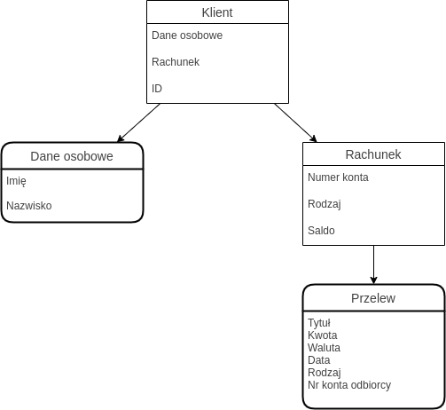

# Zadanie 1
## Opis zadania
W ramach zadania dotyczącego zastosowania zasad Domain Driven Design (DDD) przygotowałem
opis modelu fragmentu aplikacji do bankowości. W ramach modelu wyróżniłem trzy różne
konteksty: przelewy, procedura zamrożenia karty płatniczej oraz zarządzanie kontem.
W każdym z kontekstów zawiera się jeden agregat, którego korzeniem jest encja **Klient**.

## Schematy
### Kontekst: przelewy

### Kontekst: zamrożenie karty płatniczej

### Kontekst: zarządzanie kontem

## Założenia
|Założenie|Opis|
|---|---|
|Encja **Klient**|Unikatowy identyfikator (UUID), dane osobowe oraz adres będące OV, może zawierać wiele encji typu **Rachunek** oraz **Lokata**|
|Encja **Rachunek**|Unikatowy numer konta składający się z 26 cyfr, saldo będące liczbą rzeczywistą z dokładnością do dwóch cyfr po separatorze dziesiętnym, rodzaj konta bedący identyfikatorem oferty banku|
|Encja **Karta**|Unikatowy numer karty składający się z 16 cyfr, identyfikator operatora karty, identyfikator rodzaju karty (debetowa lub jedna z kredytyowych), binarny status zamrożenia karty|
|Encja **Dane logowania**|Hasło z shashowane przy pomocy funkcji skrótu Argon2|
|Encja **2FA**|Identyfikator rodzaju 2FA (aplikacja, klucz sprzętowy, SMS) oraz wygenerowany klucz prywatny RSA|
|Encja **Lokata**|Oprocentowanie lokaty będące nieujemną liczbą rzeczywistą z dokładnością do dwóch cyfr po separatorze dziesiętnym, kwota ulokowanych pieniędzy będąca liczbą rzeczywistą z dokładnością do 2 cyfr po separatorze dziesiętnym oraz okres lokaty będący liczbą dni (liczba naturalna)|
|OV **Dane osobowe**|PESEL będący 11-cyfrowym identyfikatorem|
|OV **Adres**|Numer budynku oraz numer lokalu będące liczbami naturalnymi oraz kod pocztowy będący sekwencją dwie cyfry, dywiz (-) trzy cyfry|
|OV **Przelew**|Kwota będąca liczbą rzeczywistą z dokładnością do 2 cyfr po separatorze dziesiętnym oraz numer rachunku odbiorcy składający się z 26 cyfr|
